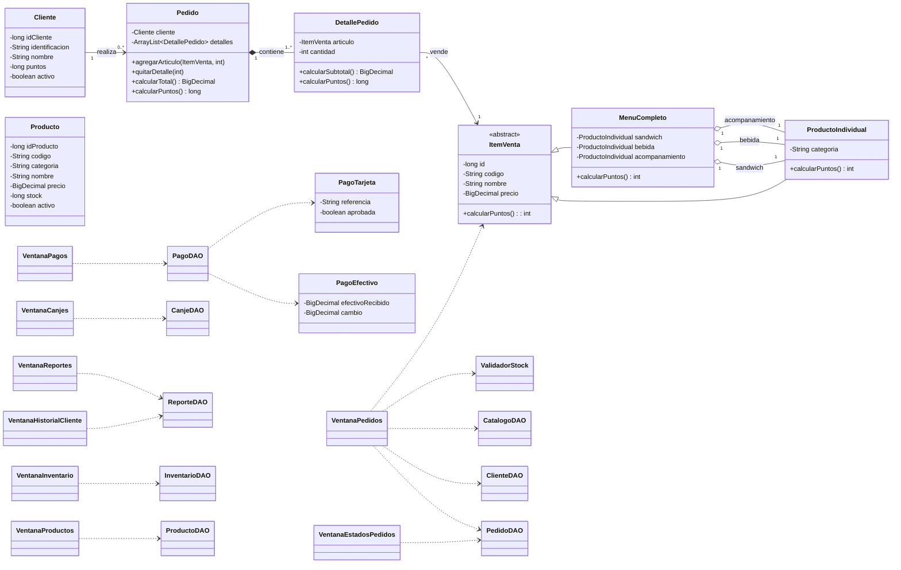

# Diagrama de clases UML

El diagrama muestra el modelo orientado a objetos central y la relación de las ventanas con sus clases de acceso a datos.

```mermaid
classDiagram
    direction LR

    class Cliente {
        -long idCliente
        -String identificacion
        -String nombre
        -long puntos
        -boolean activo
    }

    class Producto {
        -long idProducto
        -String codigo
        -String categoria
        -String nombre
        -BigDecimal precio
        -long stock
        -boolean activo
    }

    class Pedido {
        -Cliente cliente
        -ArrayList~DetallePedido~ detalles
        +agregarArticulo(ItemVenta, int)
        +quitarDetalle(int)
        +calcularTotal() BigDecimal
        +calcularPuntos() long
    }

    class DetallePedido {
        -ItemVenta articulo
        -int cantidad
        +calcularSubtotal() BigDecimal
        +calcularPuntos() long
    }

    class ItemVenta {
        <<abstract>>
        -long id
        -String codigo
        -String nombre
        -BigDecimal precio
        +calcularPuntos(): int
    }

    class ProductoIndividual {
        -String categoria
        +calcularPuntos() int
    }

    class MenuCompleto {
        -ProductoIndividual sandwich
        -ProductoIndividual bebida
        -ProductoIndividual acompanamiento
        +calcularPuntos() int
    }

    class PagoEfectivo {
        -BigDecimal efectivoRecibido
        -BigDecimal cambio
    }

    class PagoTarjeta {
        -String referencia
        -boolean aprobada
    }

    class VentanaPedidos
    class VentanaPagos
    class VentanaCanjes
    class VentanaInventario
    class VentanaProductos
    class VentanaHistorialCliente
    class VentanaReportes
    class VentanaEstadosPedidos

    class ClienteDAO
    class PedidoDAO
    class PagoDAO
    class CanjeDAO
    class ReporteDAO
    class InventarioDAO
    class ProductoDAO
    class CatalogoDAO
    class ValidadorStock

    ItemVenta <|-- ProductoIndividual
    ItemVenta <|-- MenuCompleto
    Pedido "1" *-- "1..*" DetallePedido : contiene
    DetallePedido "*" --> "1" ItemVenta : vende
    MenuCompleto "1" o-- "1" ProductoIndividual : sandwich
    MenuCompleto "1" o-- "1" ProductoIndividual : bebida
    MenuCompleto "1" o-- "1" ProductoIndividual : acompanamiento
    Cliente "1" --> "0..*" Pedido : realiza

    VentanaPedidos ..> PedidoDAO
    VentanaPedidos ..> ClienteDAO
    VentanaPedidos ..> CatalogoDAO
    VentanaPedidos ..> ValidadorStock
    VentanaPedidos ..> ItemVenta
    VentanaProductos ..> ProductoDAO
    VentanaInventario ..> InventarioDAO
    VentanaPagos ..> PagoDAO
    VentanaCanjes ..> CanjeDAO
    VentanaHistorialCliente ..> ReporteDAO
    VentanaReportes ..> ReporteDAO
    VentanaEstadosPedidos ..> PedidoDAO
    PagoDAO ..> PagoEfectivo
    PagoDAO ..> PagoTarjeta
```
